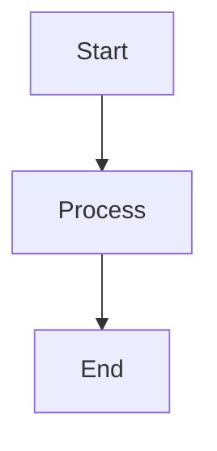

# Agentic DAG & Telegram Bot Project

This repository provides a lightweight framework for agentic workflows that can:

- Define a directed acyclic graph (DAG) of tasks or knowledge nodes.
- Interact through a Telegram bot to add, inspect, and manage the DAG.
- Render the DAG as Mermaid JS syntax for compatible viewers.
- Register Telegram chats for proactive human-review notifications.

## Directory Layout

```text
agentic-dag/
├── src/
│   ├── dag.py            # DAG persistence and the optional state-file override.
│   ├── bot.py            # Telegram command handlers.
│   ├── notifications.py  # Local registered-chat storage.
│   ├── notify.py         # CLI sender for human-review notifications.
│   ├── visualize.py      # Mermaid generation utilities.
│   └── main.py           # Bot entry point.
├── requirements.txt
└── README.md
```

## Quick Start

1. Install dependencies:

   ```bash
   python -m venv .venv
   source .venv/bin/activate
   pip install -r requirements.txt
   ```

2. Create a Telegram bot through `@BotFather`, then configure `TELEGRAM_BOT_TOKEN` as described below.

3. Start the bot:

   ```bash
   python -m src.main
   ```

4. In the Telegram chat that should receive human-review requests, send:

   ```text
   /register
   ```

   The bot stores that chat ID locally. Do not share the chat ID or bot token in source control.

## Environment Variables

Create a `.env` file at the repository root. Only the token is required:

```dotenv
# Required
TELEGRAM_BOT_TOKEN=YOUR_TELEGRAM_BOT_TOKEN_HERE

# Optional: defaults to ./dag_state.json beside this repository.
DAG_STATE_FILE=/path/to/dag_state.json

# Optional: defaults to a sibling workspace dag/telegram_notification_chat_ids.json path.
TELEGRAM_NOTIFICATION_REGISTRY=/path/to/telegram_notification_chat_ids.json

# Optional: defaults beside DAG_STATE_FILE as dag_export.json.
DAG_EXPORT_FILE=/path/to/dag_export.json
```

`DAG_STATE_FILE` is useful when the tracker code and its persisted project state live in separate directories. The bot loads this file on startup and saves every DAG mutation back to the same path.

## Bot Commands

| Command | Description |
|---------|-------------|
| `/start` | Welcomes the user and lists commands. |
| `/register` | Registers the current Telegram chat for human-review notifications. Repeating it is safe. |
| `/add_node <node_id> <label>` | Adds a node to the DAG. |
| `/add_edge <from_id> <to_id>` | Adds a directed edge, provided the graph stays acyclic. |
| `/show` | Prints a concise text representation of the DAG. |
| `/visualize` | Replies with Mermaid JS syntax. |
| `/export` | Sends the DAG JSON export; the destination is controlled by `DAG_EXPORT_FILE`. |

## Human-Review Notifications

After at least one chat has sent `/register`, send a notification from the repository root:

```bash
python -m src.notify "Action needed: review the current DAG task."
```

The command sends the message to every locally registered chat. It fails safely if no chat has registered. The chat registry is local state and should be excluded from version control.

## Mermaid Visualization

`visualize.py` converts the graph to Mermaid syntax:



Use a Mermaid-compatible Markdown preview, GitHub, or Mermaid Live Editor to render the result.

## Persistence

The DAG is persisted as NetworkX node-link JSON. By default it is stored in `dag_state.json` at the repository root. Set `DAG_STATE_FILE` to place it elsewhere; node metadata can hold compact task labels as well as richer project context.

## License

MIT
