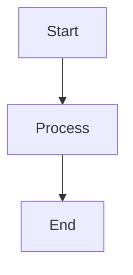

# Agentic DAG & Telegram Bot Project

This repository provides a lightweight framework for agentic workflows that can:

- Define a directed acyclic graph (DAG) of tasks or knowledge nodes.
- Interact through a Telegram bot to add, inspect, and manage the DAG.
- Render the DAG as Mermaid JS syntax for compatible viewers.
- Register Telegram chats for proactive human-review notifications.

## Project Layout

```text
agentic-dag/
├── src/
│   ├── dag.py            # DAG persistence and the optional state-file override.
│   ├── bot.py            # Telegram command handlers.
│   ├── notifications.py  # Local registered-chat storage.
│   ├── notify.py         # CLI sender for human-review notifications.
│   ├── visualize.py      # Mermaid generation utilities.
│   ├── main.py           # Telegram bot entry point.
│   ├── run_web.py        # Web server entry point.
│   ├── web.py            # FastAPI API and bot manager.
│   └── static/
│       ├── index.html    # Control-panel single-page app.
│       └── visualize.html # Rendered Mermaid diagram page.
├── requirements.txt
├── dag_state.json        # Default persisted DAG (created on first save).
└── README.md
```

## Quick Start

1. Install dependencies:

   ```bash
   python -m venv .venv
   source .venv/bin/activate
   pip install -r requirements.txt
   ```

2. Create a Telegram bot through `@BotFather`, then configure `TELEGRAM_BOT_TOKEN` as described below.

3. Start the bot:

   ```bash
   python -m src.main
   ```

4. In the Telegram chat that should receive human-review requests, send:

   ```text
   /register
   ```

   The bot stores that chat ID locally. Do not share the chat ID or bot token in source control.

## Environment Variables

Create a `.env` file at the repository root. Only the token is required:

```dotenv
# Required
TELEGRAM_BOT_TOKEN=YOUR_TELEGRAM_BOT_TOKEN_HERE

# Optional: defaults to ./dag_state.json beside this repository.
DAG_STATE_FILE=/path/to/dag_state.json

# Optional: defaults to a sibling workspace dag/telegram_notification_chat_ids.json path.
TELEGRAM_NOTIFICATION_REGISTRY=/path/to/telegram_notification_chat_ids.json

# Optional: defaults beside DAG_STATE_FILE as dag_export.json.
DAG_EXPORT_FILE=/path/to/dag_export.json
```

`DAG_STATE_FILE` is useful when the tracker code and its persisted project state live in separate directories. The bot loads this file on startup and saves every DAG mutation back to the same path.

## Web UI

The FastAPI control panel provides a browser interface for the DAG, Telegram bot controls, and persisted state-file selection.

Start it from the repository root:

```bash
python -m src.run_web
```

Open `http://localhost:8080`. When using a forwarded development-server URL, open its forwarded `/proxy/8080/` path instead. The UI uses paths relative to that application base, so its API calls work both at the domain root and behind a path-based proxy.

### What it provides

- Interactive D3 force-directed DAG with directed edges, drag, zoom/pan, selection, and a node context menu.
- Node and edge CRUD controls, with cycle protection enforced by the API.
- Telegram bot start/stop controls, registered-chat management, pending-review status, and notification sending.
- State-file selection with recent-file history in browser `localStorage`.
- A full-size, scrollable Mermaid.js page at `/visualize`, plus the raw Mermaid source at `/api/dag/mermaid`.
- A dedicated zoomable D3 Graph Canvas at `/graph` for navigating large DAGs without shrinking them to fit.

The control panel polls the DAG and Telegram status every five seconds. It retains the existing node layout during ordinary polling; the force simulation is reheated only when nodes, labels, or edges change.

### Architecture

```text
Browser control panel / Mermaid page
                 │ HTTP
                 ▼
FastAPI server (src/web.py)
 ├── DAG and state-file API
 ├── Telegram bot manager (background thread)
 └── static frontend
                 │
                 ▼
NetworkX DAG persisted as JSON (DAG_STATE_FILE)
```

The web API reloads its configured DAG state before reads and mutations. Set `DAG_STATE_FILE` before starting the server to ensure that the web UI and Telegram bot use the same persisted DAG. The embedded Telegram bot runs in a daemon thread with its own asyncio event loop.

### Control-panel behavior

The page has a D3 graph at left and tabs for Nodes, Edges, Telegram, and Settings. Node label prefixes determine the graph color:

| Status | Color |
|---|---|
| In Progress | Blue |
| To Do | Amber |
| Review | Purple |
| Done | Green |
| Backlog | Gray |
| Archived | Dark gray |

The Settings tab applies a state-file path to the running server and saves it locally for the current browser. It maintains these `localStorage` keys:

| Key | Description |
|---|---|
| `dag_state_file_path` | Last state-file path applied by this browser. |
| `dag_recent_files` | Up to ten recently used state-file paths. |

### HTTP API

| Method | Endpoint | Purpose |
|---|---|---|
| `GET` | `/api/config/state-file` | Get the active state-file path. |
| `PUT` | `/api/config/state-file` | Set the active state-file path: `{"path": "..."}`. |
| `GET` | `/api/dag` | Get nodes and edges. |
| `GET` | `/api/dag/mermaid` | Get generated Mermaid flowchart source. |
| `POST` | `/api/dag/nodes` | Add a node: `{"id": "...", "label": "..."}`. |
| `PUT` | `/api/dag/nodes/{node_id}` | Update a node label. |
| `DELETE` | `/api/dag/nodes/{node_id}` | Delete a node and its connected edges. |
| `POST` | `/api/dag/edges` | Add an edge: `{"source": "...", "target": "..."}`. |
| `DELETE` | `/api/dag/edges` | Delete an edge using `source` and `target` query parameters. |
| `GET` | `/api/telegram/status` | Get bot, registered-chat, and pending-review status. |
| `POST` | `/api/telegram/start` | Start the Telegram bot in the server process. |
| `POST` | `/api/telegram/stop` | Stop the Telegram bot. |
| `GET` | `/api/telegram/chats` | List registered chat IDs. |
| `DELETE` | `/api/telegram/chats/{chat_id}` | Remove a registered chat. |
| `POST` | `/api/telegram/notify` | Send a task-linked notification. |
| `GET` | `/visualize` | Render the current DAG with Mermaid.js. |
| `GET` | `/graph` | Open the full-screen D3 Graph Canvas. |

### Deployment notes

- The server serves the static control panel at `/` and enables permissive CORS for development.
- The browser loads D3.js and Mermaid.js from CDNs, so a browser rendering those views needs access to those CDNs.
- The UI does not provide authentication. Put it behind suitable access controls before exposing it publicly.

### Web UI roadmap

- Node metadata editing beyond labels.
- Bulk import/export from the UI.
- Authentication and authorization for production deployments.
- WebSocket updates in place of polling.
- Persisted graph-layout coordinates.
- Light-theme and mobile-layout support.

## Bot Commands

| Command | Description |
|---------|-------------|
| `/start` | Welcomes the user and lists commands. |
| `/register` | Registers the current Telegram chat for human-review notifications. Repeating it is safe. |
| `/add_node <node_id> <label>` | Adds a node to the DAG. |
| `/add_edge <from_id> <to_id>` | Adds a directed edge, provided the graph stays acyclic. |
| `/show` | Prints a concise text representation of the DAG. |
| `/visualize` | Replies with Mermaid JS syntax. |
| `/export` | Sends the DAG JSON export; the destination is controlled by `DAG_EXPORT_FILE`. |

## Human-Review Notifications

After at least one chat has sent `/register`, send a notification from the repository root:

```bash
python -m src.notify <node_id> "Action needed: review the current DAG task."
```

The command sends a task-linked message to every locally registered chat and records each sent message ID locally. Reply directly to that notification: replies beginning with `approved`, `yes`, `proceed`, or `continue` move the node to `In Progress`; replies beginning with `rejected`, `no`, `changes requested`, or `revise` move it to `To Do`; every other reply is recorded while the node stays in `Review`. The command fails safely if no chat has registered. The chat registry is local state and should be excluded from version control.

The sender emits flushed UTC diagnostics for `send_started`, Telegram acceptance, reply-mapping registration, and completion. They include the DAG node and Telegram message ID, but never a chat ID, bot token, or notification body. A failed send or mapping registration exits non-zero immediately after attempting the remaining registered recipients.

## Mermaid Visualization

`visualize.py` converts the graph to Mermaid syntax:



When the web server is running, open `/visualize` for an interactive Mermaid.js rendering of the current DAG. The page also links to the raw Mermaid source at `/api/dag/mermaid`.

Use a Mermaid-compatible Markdown preview, GitHub, or Mermaid Live Editor to render the result.

## Persistence

The DAG is persisted as NetworkX node-link JSON. By default it is stored in `dag_state.json` at the repository root. Set `DAG_STATE_FILE` to place it elsewhere; node metadata can hold compact task labels as well as richer project context.

## License

MIT
