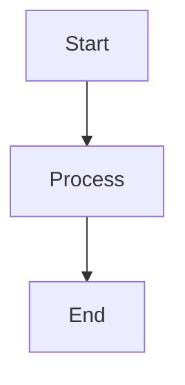

# Agentic DAG & Telegram Bot Project

This repository provides a lightweight framework for building **agentic AI workflows** that can:

- **Define** a directed acyclic graph (DAG) of tasks or knowledge nodes.
- **Interact** via a Telegram bot to add, inspect, and manage the DAG in real time.
- **Visualise** the DAG using Mermaid JS syntax, which can be rendered in any Mermaid‑compatible viewer (e.g., VS Code preview, GitHub markdown, Mermaid Live Editor).

---

## Directory Layout

```
/config/workspace/dag/
├── src/
│   ├── __init__.py
│   ├── dag.py          # Core DAG implementation and persistence.
│   ├── bot.py          # Telegram bot logic.
│   ├── visualize.py    # Mermaid‑JS generation utilities.
│   └── main.py         # Entry point to launch the bot.
├── requirements.txt    # Python dependencies.
└── README.md           # This file.
```

---

## Quick Start

1. **Install dependencies**
   ```bash
   python -m venv .venv
   source .venv/bin/activate
   pip install -r requirements.txt
   ```

2. **Create a Telegram bot**
   - Talk to `@BotFather` on Telegram, create a new bot, and obtain the **Bot Token**.
   - Copy the token into a `.env` file (see the **Environment Variables** section below).

3. **Run the bot**
   ```bash
   python -m src.main
   ```
   The bot will start and listen for commands.

---

## Environment Variables

Create a `.env` file at the repository root containing:

```
TELEGRAM_BOT_TOKEN=YOUR_TELEGRAM_BOT_TOKEN_HERE
```

The bot loads this file via `python-dotenv`.

---

## Bot Commands

| Command | Description |
|---------|-------------|
| `/start` | Welcomes the user and shows available commands. |
| `/add_node <node_id> <label>` | Adds a new node to the DAG. |
| `/add_edge <from_id> <to_id>` | Adds a directed edge (must keep the graph acyclic). |
| `/show` | Prints a concise text representation of the current DAG. |
| `/visualize` | Replies with a Mermaid‑JS diagram string. Paste this string into any Mermaid viewer to see a graphical rendering. |
| `/export` | Downloads the DAG as a JSON file for backup or external processing. |

---

## Mermaid Visualization

The `visualize.py` module converts the internal DAG representation to Mermaid syntax:



Copy the generated string into a markdown file, the GitHub UI, or the **Mermaid Live Editor** to view the diagram.

---

## Persistence

The DAG state is automatically saved to `dag_state.json` in the repository root after each mutation. The bot loads this file on startup, allowing you to resume work after restarts.

---

## Development & Extensibility

- **Custom node payloads** – Extend `DagNode` in `dag.py` to store additional metadata (e.g., timestamps, LLM prompts, results).
- **Advanced visualisation** – Hook into `visualize.py` to add subgraph styling, colors, or HTML‑like labels.
- **Integration with LangGraph** – The DAG structure mirrors the concepts used in the `langgraph-telegram-bot` repo, making it straightforward to replace the in‑memory DAG with a LangGraph checkpoint store for long‑term memory.

---

## License

MIT – feel free to adapt and reuse for your own agentic AI projects.

---

## Next Steps

- Deploy the bot to a cloud container (Docker support is forthcoming).
- Add rate‑limiting and security measures (e.g., restrict commands to authorized users).
- Hook the DAG into a larger LLM‑driven workflow using `langgraph` or similar libraries.

---

*This scaffold is inspired by the public repositories **`francescofano/langgraph-telegram-bot`** and **`drivly/agentic.md`**, adapting their ideas into a minimal, framework‑agnostic toolkit.*
